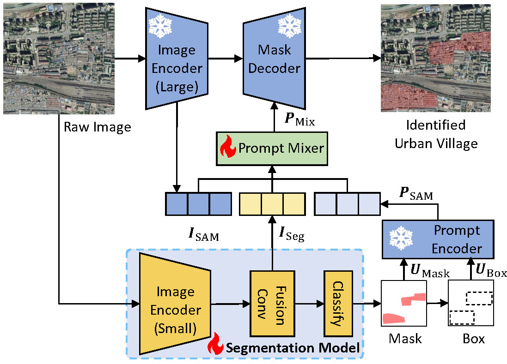
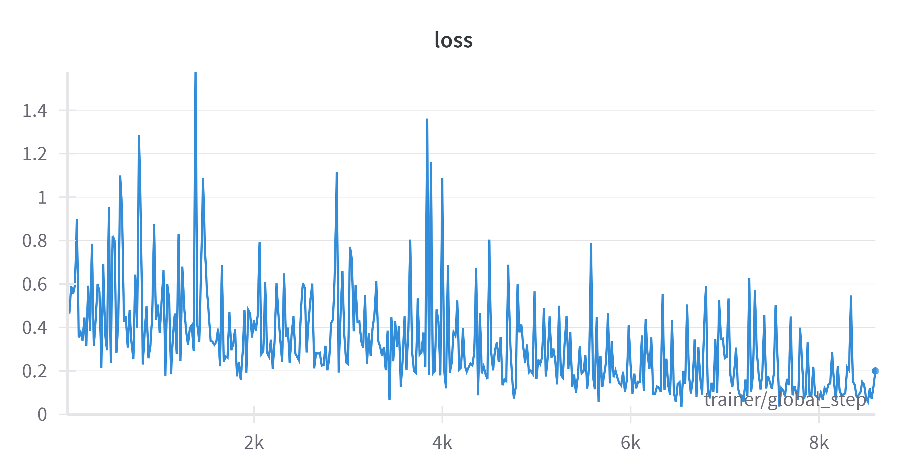
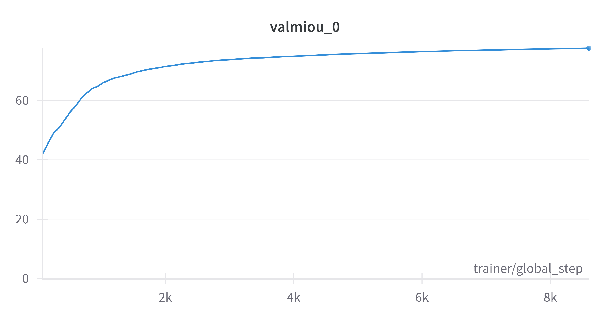

# UV-SAM: Adapting Segment Anything Model for Urban Village Identification


This repository is the official pytorch implementation for paper: [UV-SAM: Adapting Segment Anything Model for Urban Village Identification](https://arxiv.org/abs/2401.08083), AAAI, 2024.

## Requirements

```
pip install -r requirements.txt
```

## Dataset

Here we provide the dataset of Beijing and Xi'an for reproducibility, and the image data can be downloaded from *[here](https://drive.google.com/drive/folders/1szict970v0Z7LrY78jPQkNG1UzTHT1gb?usp=sharing)*.

## Training & Testing

The code is tested under a Linux desktop with torch 2.0.1 and Python 3.10. All experiments are conducted on a single NVIDIA GeForce RTX4090 with 24GB memory.

**Training:**

For the Beijing results, we can implement the model by running the following command:

```python
CUDA_VISIBLE_DEVICES=0 python tools/train.py --config ./configs/SegSAMPLerEmbMLP_config.py --cfg-options optimizer.lr=0.0005 optimizer.weight_decay=0.01 train_batch_size_per_gpu=4 test_batch_size_per_gpu=4 model_cfg.SAM_weights=0.1 model_cfg.hyperparameters.optimizer.lr=0.0005 model_cfg.hyperparameters.optimizer.weight_decay=0.01
```

As for the Xi'an results, we can implement the model by running the following command:

```python
CUDA_VISIBLE_DEVICES=0 python tools/train.py --config ./configs/SegSAMPLerEmbAdd_config.py --cfg-options optimizer.lr=0.0005 optimizer.weight_decay=0.001 train_batch_size_per_gpu=4 test_batch_size_per_gpu=4 model_cfg.SAM_weights=1 model_cfg.hyperparameters.optimizer.lr=0.0005 model_cfg.hyperparameters.optimizer.weight_decay=0.001
```

**Testing:**

```
python inference_seg.py
```

<center class="half">
  
</center>

Here, we provide two figures to show the training loss and validation mIoU of the Beijing dataset. 
We also put the training log in the **./log/** path, which can be used to view detailed information during training. Specifically, the training time is about 6 hours for 100 epochs, and the testing time is about 2 minutes for one epoch. The training time is determined by the CPU and GPU load, and the above time is just a rough estimate.

## Trained Models

Our model parameters in the paper are lost, because of the server cleaning files regularly. As a result, we re-searched the parameters and updated the code, which can basically achieve the same reported results as in the paper and exceed the baselines.The pretrained model and trained model can be downloaded from the following link: *[Google Drive](https://drive.google.com/drive/folders/1szict970v0Z7LrY78jPQkNG1UzTHT1gb?usp=sharing)*. The difference between mmsegmentation and pretrained model is that we just changed the key of pretrained model. The pretrained model's parameters are the same as the mmsegmentation model. The grid search file can be found in the **./grid_search.sh** path.

**Beijing Dataset**
| Model | IoU   | F1-Score | Recall | Precision | 
| ------- |:-----:|:--------:|:------:|:---------:|
|FCN | 0.660 | 0.802    | 0.752  | 0.859     |
|DeepLabv3+ |0.650|0.787|0.719|0.870|
|UVLens | 0.623 |0.783 | 0.777|0.790|
|RSprompter | 0.462 |0.687 |0.860 |0.571|
|UV-SAM | 0.721 | 0.871 | 0.893 | 0.851 |
|Reproduce | 0.712 | 0.872    | 0.876  | 0.869     |

**Xi'an Dataset**
| Model | IoU   | F1-Score | Recall | Precision | 
| ------- |:-----:|:--------:|:------:|:---------:|
|FCN | 0.720|0.833|0.800|0.870|
|DeepLabv3+ |0.668|0.821|0.780|0.867|
|UVLens | 0.687 |0.863 | 0.880|0.867|
|RSprompter | 0.568 | 0.800| 0.800 | 0.800|
|UV-SAM | 0.747 | 0.904 | 0.940 | 0.871 |
|Reproduce | 0.749 | 0.885 | 0.92| 0.852 |

## Acknowledgement

The implemention is based on *[RSPrompter](https://github.com/KyanChen/RSPrompter)*. Thanks to the developers of the RSPrompter project.
We also thank the developers of *[mmsegmentation](https://github.com/open-mmlab/mmsegmentation
)* for providing the pre-trained models.

## Citation

If you are using the provided datasets/codes or find this work helpful for your project, please give it a star and a citation:

```
@article{zhang2024uvsam,
  title={UV-SAM: Adapting Segment Anything Model for Urban Village Identification},
  volume={38},
  url={https://ojs.aaai.org/index.php/AAAI/article/view/30260},
  DOI={10.1609/aaai.v38i20.30260},
  number={20},
  journal={Proceedings of the AAAI Conference on Artificial Intelligence},
  author={Zhang, Xin and Liu, Yu and Lin, Yuming and Liao, Qingmin and Li, Yong},
  year={2024},
  month={Mar.},
  pages={22520-22528}
}
```

@article{Zhang_Liu_Lin_Liao_Li_2024, title={UV-SAM: Adapting Segment Anything Model for Urban Village Identification}, volume={38}, url={https://ojs.aaai.org/index.php/AAAI/article/view/30260}, DOI={10.1609/aaai.v38i20.30260}, , number={20}, journal={Proceedings of the AAAI Conference on Artificial Intelligence}, author={Zhang, Xin and Liu, Yu and Lin, Yuming and Liao, Qingmin and Li, Yong}, year={2024}, month={Mar.}, pages={22520-22528} }
